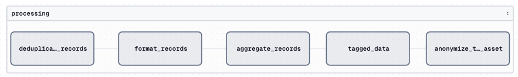

# National Data Library Core Data Pipeline

The data pipeline supporting the AI-ready core of the National Data Library

## Table of Contents
- [Overview](#overview)
- [Data Pipelines Overview](#data-pipelines-overview)
  - [Data Collection](#data-collection)
  - [Data Refinement](#data-refinement)
  - [Data Embedding](#data-embedding)
- [Published Data](#published-data)
- [Developer Instructions](#developer-instructions)
  - [Installing dependencies](#installing-dependencies)
  - [Install system packages](#install-system-packages)
  - [Running the data pipeline](#running-the-data-pipeline)

## Overview

This project uses [Dagster](https://dagster.io/) as the orchestration framework. Three main pipelines are defined:
- **Data Collection**: Ingests raw data from various sources, performs initial processing, and stores it in a staging area.
- **Data Refinement**: Processes the staged data, applies transformations, and prepares it for final storage and deployment.
- **Data Embedding**: Generates embeddings for the refined data using state-of-the-art models and stores them for AI/ML applications.

## Data Pipelines Overview

### Data Collection
The **Data Collection Pipeline** is responsible for collecting raw data from various sources, such as:
- **data.gov.uk**: Crawls datasets using the CKAN API. Categories are dynamically discovered, and datasets are filtered based on public licenses (e.g., OGL, CC-BY).
- **gov.uk**: Fetches government publications and announcements. The pipeline dynamically partitions data into batches for efficient processing.
- **legislation.gov.uk**: Downloads legal documents from the 2025 Atom data feed.
- **ons.gov.uk**: Fetches the list of topics from the ONS API and retrieves the latest timeseries datasets for each topic.
- **hansard.parliment.uk**: This is not part of the Dagster data collection pipeline. Due to the nature of the source, data is downloaded directly using `rsync` commands as detailed in the source README.

Each data source is processed using a rate-limited API client to ensure compliance with API usage policies. The raw data is stored in respective directories under `data/raw/`.

### Data Refinement
The **process_pipeline** takes the staged data and applies the following transformations:
- **Cleaning**: Removes duplicates, handles missing values, standardizes formats (such as ISO 8601 dates) and removes Personal Identifiable Information (such as phone numbers and email addresses).
- **Enrichment**: Adds metadata such as [EU Data Theme](https://op.europa.eu/en/web/eu-vocabularies/concept-scheme/-/resource?uri=http://publications.europa.eu/resource/authority/data-theme) tags, automatically detected language tags, word and token counts.
- **Structuring**: Converts raw data into structured and easily processable formats. Converts structured data formats like CSV, JSON, XLSX and ODS into Parquet for efficient processing. Converts PDF files into text using OCR where necessary. Extracts text from HTML content.

These steps ensure the data is consistent, reliable, and ready for downstream tasks.

<p style="text-align: center;">
  
</p>

### Data Embedding
The refined data is further processed to generate embeddings, which are vectorized representations of the data. This involves:
- **Text Chunking**: Text data is split into chunks using the `RecursiveCharacterTextSplitter` with a chunk size of 800 characters and an overlap of 100 characters.
- **Embedding Generation**: The `SentenceTransformer` model (`all-MiniLM-L6-v2`) is used to generate embeddings for the text chunks. This ensures high-quality vector representations suitable for similarity search.
- **Indexing**: The embeddings are stored in a FAISS index for fast similarity search. IDs order (indexes) are maintained to map back to the original data chunks.

These embeddings are used for AI/ML tasks, such as similarity search, clustering, or classification. The embedding process is integrated into the **process_pipeline** and ensures the data is AI-ready.

## Published Data

Cleaned datasets and their embeddings are published to Hugging Face for access by downstream applications. The published data and their details can be found on the [National Data Library Hugging Face collection](https://huggingface.co/collections/theodi/ndl-core-collection) page.

## Developer Instructions

### Installing dependencies

Ensure [`uv`](https://docs.astral.sh/uv/) is installed following their [official documentation](https://docs.astral.sh/uv/getting-started/installation/).

Create a virtual environment, and install the required dependencies using _sync_:

```bash
uv sync
```

Then, activate the virtual environment:

| OS | Command |
| --- | --- |
| MacOS | ```source .venv/bin/activate``` |
| Windows | ```.venv\Scripts\activate``` |

---

### Install system packages

Install `tesseract` and `poppler` to your system. `pdf2image` requires the poppler utilities to convert PDF pages to images. You can install poppler with:

```bash
brew install tesseract
or
sudo apt install tesseract-ocr
```

```bash
brew install poppler
or
sudo apt install poppler-utils
```

---

### Running the data pipeline

Start the Dagster UI web server:

```bash
dg dev
```

Open http://localhost:3000 in your browser to see the project.
